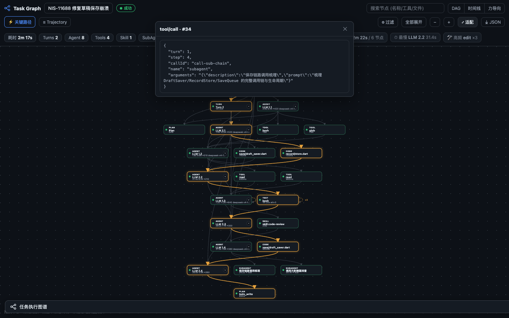
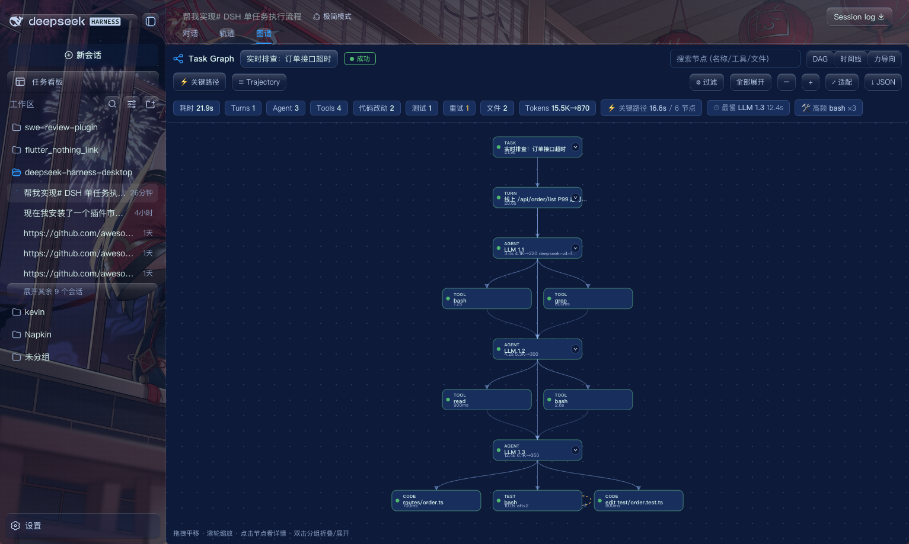

# dsh-task-graph · DSH 单任务执行流程图谱

> 给 [DeepSeek Harness (DSH)](https://github.com/deepseek-ai/dsh) 的**单个任务**画一张可交互的执行流程图谱：从 `任务开始 → Agent → Skill/Tool → 子任务 → 代码改动 → 测试 → 成功/失败/重试` 一眼看清，支持实时执行状态与历史回溯。



- **Task First**：第一层概念是 Task（一次会话），不是 Session/Message/Event 流水。
- **Graph First**：进入任务先看到执行图谱，而不是一长串日志。
- **Detail on Demand**：节点只显示状态/时间/关系，JSON、Prompt、堆栈收进右侧详情面板。
- **Trajectory 是底层数据**：图谱由 `session.jsonl`（zstd）解析而来，节点保留 Event ID，可与原始 Trajectory 双向跳转。

---

## 功能总览

| 能力 | 说明 |
| --- | --- |
| 单任务图谱 | Task → Turn → Agent(step) → Tool / Skill / SubAgent / Code / Test |
| 实时状态 | 会话正在运行时通过 SSE 增量刷新，`RUNNING` 节点脉冲高亮 + LIVE 徽标 |
| 并行执行 | 同一步骤内并行工具调用渲染为 fork → join |
| 重试/循环 | 相同调用失败后重试聚合为一个节点的多条 attempt，不复制节点；LLM 重试也聚合 |
| 节点详情 | 状态/耗时/模型/Token/输入输出/错误/重试历史/对应 Trajectory 事件 |
| Graph ↔ Trajectory | 点节点高亮对应事件行；点事件行反选图谱节点 |
| 三种布局 | DAG（分层）、时间线（按真实耗时）、力导向（探索） |
| 关键路径 | 自动计算耗时主导链，⚡ 高亮 |
| 过滤 / 折叠 | 按节点类型过滤；分组节点（Turn/任务）折叠/展开 |
| 任务摘要 | 耗时、Turn/Agent/Tool/Skill/SubAgent/改动/测试/重试/错误数、Token、最慢步骤、高频工具 |
| 错误定位 | 失败任务直接标红，失败节点聚合错误信息与重试链 |

## 快速开始

### 独立 Demo（无需安装 DSH）

```bash
npm run demo            # 使用内置脚本化数据
npm run demo -- --real  # 读取你本机真实 DSH_HOME 会话
```

打开浏览器访问打印出的地址（默认 `http://127.0.0.1:4173`）。Demo 会加载一个"正在运行"的脚本任务，你能看到节点随事件实时出现。

### 作为 DSH 插件安装

本插件遵循 DSH profile bundle 约定（`cordis.patch.yml` + `dsh.client`），与插件市场里的其它插件一致。把它链接进你的 web profile：

```bash
# 在 DSH web profile 目录下（示例）
cd "$DSH_HOME/profiles/web"
pnpm add "dsh-task-graph@link:/path/to/dsh-task-graph"
# 然后在 package.json 的 dsh.profile.bundles 里加入 "dsh-task-graph"
pnpm install
```

重启（或在 DSH 中重新加载 Web UI）后，原生「对话 / 轨迹」标签旁会出现第三个「图谱」Tab；点击后只在内容区展示任务执行图谱——标签栏、侧边栏与其它功能入口保持可见。点回「对话 / 轨迹」或按 Esc 即恢复原视图。



> 服务端需要 Node ≥ 22.15（用内置 `zlib.zstdDecompressSync` 解码 `.zstd` 会话，零原生依赖）。

## 架构

```
DSH session.jsonl (zstd, 多帧)
        │  lib/sessions.js  逐帧解码 + 缓存 + 增量
        ▼
lib/graph.js  buildGraph(events)      ← 纯函数，Node/浏览器通用
        │   nodes[] + edges[] + summary
        ▼
lib/analytics.js  criticalPath / performanceProfile
        ▼
lib/routes.js  createApi(store)       ← /task-graph/api/*（任务列表/图谱/事件/单事件）
        │                               + startLiveStream(SSE 实时尾随)
        ├──────────────┬───────────────────────────┐
        ▼              ▼                            ▼
 lib/index.js     demo/server.mjs            lib/client.js
 (DSH webServer    (独立 demo 服务)          (浏览器 UI：SVG 渲染、
  挂载 HTTP 路由)                            布局、详情、Trajectory 联动)
```

- **`lib/graph.js` / `lib/analytics.js`** 是纯模块，被服务端、demo、单测共享，保证"同一套构建逻辑"。
- **`lib/client.js`** 零依赖纯 DOM + SVG；既能被 DSH 的 `window.__ModuleLoader__` 加载，也能被 demo 页当作普通 `<script>` 直接运行。

## HTTP API

所有接口均为只读 `GET`，前缀 `/task-graph`：

| 路由 | 说明 |
| --- | --- |
| `/task-graph/api/status` | 健康检查、版本、DSH_HOME |
| `/task-graph/api/tasks?roots=true&q=&limit=` | 任务（会话）列表 + 摘要统计 |
| `/task-graph/api/task?id=<workspace>/<dir>` | 完整图谱（nodes/edges/summary/critical_path） |
| `/task-graph/api/events?id=…&from=` | 紧凑轨迹事件（用于联动抽屉） |
| `/task-graph/api/event?id=…&seq=` | 单条事件完整 payload |
| `/task-graph/api/live?id=…` | SSE 实时尾随新事件 |

## 数据模型

图谱统一为（详见 [`docs/data-model.md`](docs/data-model.md)）：

```json
{
  "task_id": "…",
  "nodes": [{ "id": "…", "type": "agent", "status": "SUCCESS", "event_ids": [12, 13], "parent_id": "phase-1", "…": "…" }],
  "edges": [{ "source": "…", "target": "…", "type": "calls" }]
}
```

节点类型：`task / phase / agent / tool / skill / subagent / code / test / plan`；
节点状态：`PENDING / RUNNING / SUCCESS / FAILED / SKIPPED / CANCELLED / RETRYING`；
边类型：`contains / depends_on / calls / invokes / delegates / consumes / modifies / validates / produces / retries`。

## 开发

```bash
npm test        # node:test 单测（30 例）
npm run demo    # 本地预览
```

目录结构：

```
lib/        index.js 服务端入口 · sessions.js 解码 · graph.js 构建 ·
            analytics.js 分析 · routes.js HTTP API · client.js 浏览器 UI
demo/       server.mjs · index.html · sample-events.js（脚本化数据）
test/       node:test 单测 + fixtures
docs/       data-model.md · trajectory-events.md · images/
```

## 路线图

- [x] MVP：单任务图谱、Task→Agent→Tool→Result、DAG、状态、详情、Graph↔Trajectory、缩放/折叠、重试、实时
- [x] 第二阶段：Skill/SubAgent、并行、循环、关键路径、时间线、Token/摘要、搜索/过滤
- [ ] 第三阶段：业务知识节点、代码语义图（Producer/Transformer/Consumer、调用链）、候选代码→Patch→Test 闭环

## License

MIT
