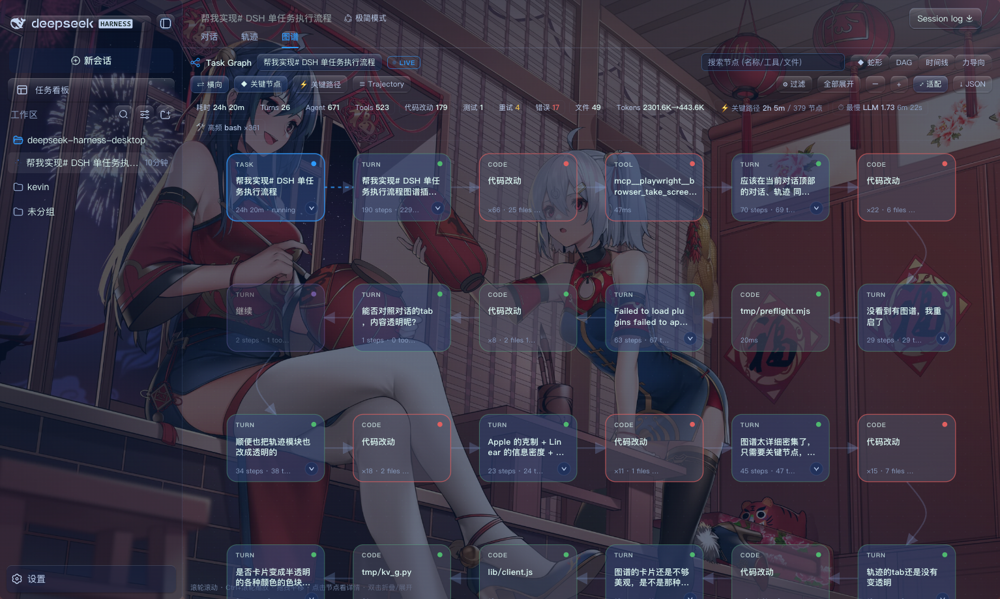
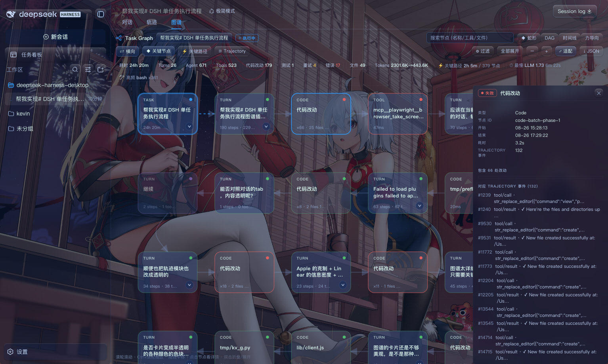
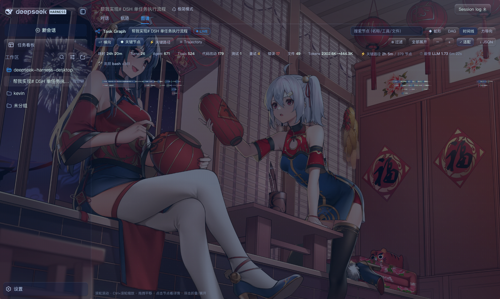
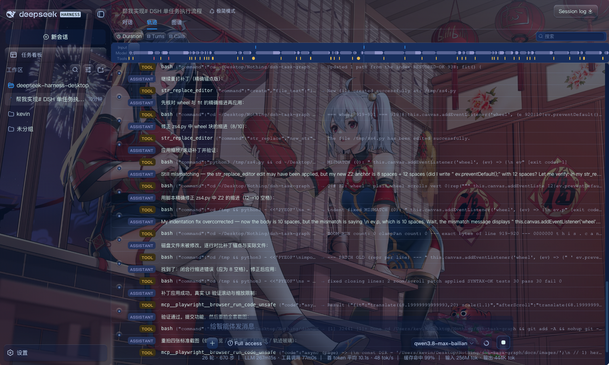

# dsh-task-graph · Task Flow Graph for DeepSeek Harness

[中文](README.md) | **English**

> An interactive **execution-flow graph for a single task** in [DeepSeek Harness (DSH)](https://github.com/deepseek-ai/dsh): see the whole run at a glance — `task start → Agent / Skill / Tool → subtasks → code changes → tests → success / failure / retries` — with live execution status and historical replay.



- **Task First** — the first-class concept is the Task (one session), not a Session/Message/Event firehose.
- **Graph First** — open a task and see the execution graph, not a wall of logs.
- **Detail on Demand** — the canvas shows key nodes only; what exactly happened (every LLM step, every tool call, inputs/outputs, errors, retries) lives in the detail panel.
- **Trajectory as the data layer** — graphs are built from `session.jsonl` (zstd); nodes keep their Event IDs and link both ways to the raw trajectory.

---

## Design Language

Restrained information visualization blending four sensibilities:

| Influence | In the product |
| --- | --- |
| **Apple restraint** | hairline borders, desaturated palette, soft glows instead of heavy shadows, status = tint + dot |
| **Linear density** | compact toolbars, tabular numerals, dense detail logs, more per screen |
| **Vercel precision** | global `tabular-nums`, uppercase micro-labels, pixel-aligned spacing, elevation only on floating surfaces |
| **Live agent feel** | pulsing RUNNING nodes with per-second timers, animated dash-flow on active edges, breathing LIVE badge |

The UI is **glassmorphic**: graph / detail / trajectory sit transparent over your skin wallpaper, exactly like the native Conversation/Trajectory tabs. Every card is tinted by **node type** (task blue · turn indigo · agent cyan · tool slate · skill violet · subagent amber · plan green · code orange · test sky).

---

## Features

### Key-node view (default canvas)

The canvas shows only **semantically important** nodes, so 500-step sessions stay readable:

- **Turn** cards carry a summary line (`N steps · N tools · N tok · ↻retries · ✗failures`)
- **Code change** batching: many edits in one turn collapse into one `×N · M files` card
- Kept events: **Plan / Skill / SubAgent / Tests / failed-or-retried tools / LLM retries**
- Plain steps and read-only tools stay off the canvas — they are all in the detail panel



Click any key node and the right-hand panel shows **what actually happened**:

- Click a **Turn** → “Execution detail · N steps”: every LLM step (model / duration / tokens / retries) plus all its tool calls
- Click **Code changes** → “N edits included”: file-level list; click a row to drill into that edit's input/output
- Any tool row is clickable and drills deeper

### Layouts & interaction

- **Snake (default)** — up to 6 key nodes per row, left→right, wrap down, right→left (boustrophedon); ordered by the task→turn→key-event execution narrative, so you read the whole run like a document
- **DAG** — layered directed graph; one-click toggle between ⇄ horizontal / ⇅ vertical
- **Timeline** — events placed at their real timestamps; parallels and costs at a glance
- **Force** — free exploration of complex relations
- **Wheel scrolls vertically** through long graphs; `Ctrl/⌘ + wheel` zooms at the cursor (bounded 0.3×–2.2× so it never shrinks unreadably); drag to pan, ⤢ fit-to-width, collapse/expand, type filters, search, focus node, neighborhood highlight



### Live execution state

Running sessions refresh incrementally over **SSE**:

- `RUNNING` nodes pulse and tick per second (`18.2s · running`, live)
- Edges touching running nodes animate a **dash flow** — data in motion
- **LIVE** badge up top; status machine `PENDING / RUNNING / SUCCESS / FAILED / SKIPPED / CANCELLED / RETRYING`

### Graph ↔ Trajectory, both ways

- Click a node → the trajectory drawer highlights and scrolls to its events
- Click an event row → the matching graph node is selected and focused
- Nodes keep `event_ids` / `session_id` / `task_id` / timestamps — always answerable: “which Event is this node?”
- The Trajectory tab itself is glass-transparent, matching Conversation and Graph



### Analysis & localization

- **Critical path** — the duration-dominating chain, auto-computed and highlighted (projects to turn level in key view)
- **Error localization** — failed nodes go red, bundling message / I-O / retry history / recovery
- **Retry aggregation** — retries of an identical call never duplicate nodes; they aggregate as attempts + a retry arc
- **Task summary** — duration; turns / agents / tools / skills / subagents / code changes / tests / retries / errors; tokens; slowest steps; most-used tools
- **Parallel execution** — concurrent tools within one step render as fork → join
- **Subtask drill-down** — SubAgent nodes link their child session; open the child graph in one click

---

## Quick Start

### Standalone demo (no DSH needed)

```bash
npm run demo            # scripted data (includes a live RUNNING task)
npm run demo -- --real  # read your real $DSH_HOME sessions
npm run demo -- --port 8123
```

Open the printed URL; the graph floats over the page and auto-loads a task.

### Install as a DSH plugin (one line)

```bash
dsh plugin --profile web add github:KevinZhangNothing/dsh-task-graph
```

`dsh plugin` runs pnpm and **automatically** registers packages declaring `dsh.bundle` into `dsh.profile.bundles` (verified). Restart the engine (or reload the Web UI) and a third **Graph** tab appears beside the native Conversation / Trajectory tabs.

> Once published to npm: `dsh plugin --profile web add dsh-task-graph`.
> Also searchable in the plugin marketplace (dshmarket).

The Graph tab renders only inside the content area — tab bar, sidebar and every other entry point stay visible. Click back to Conversation / Trajectory or press `Esc` to return.

### Local development install

```bash
dsh plugin --profile web add link:/path/to/dsh-task-graph
# or manually: pnpm add "dsh-task-graph@link:/path/to/dsh-task-graph" inside the profile dir
```

> The server half needs Node ≥ 22.15 (built-in `zlib.zstdDecompressSync` decodes `.zstd` sessions — zero native dependencies).

---

## Architecture

```
DSH session.jsonl (zstd, multi-frame)
        │  lib/sessions.js  frame-by-frame decode + cache + incremental tail
        ▼
lib/graph.js  buildGraph(events)      ← pure functions, Node/browser shared
        │   nodes[] + edges[] + summary
        ▼
lib/analytics.js  criticalPath / performanceProfile
        ▼
lib/routes.js  createApi(store)       ← /task-graph/api/* (tasks/graph/events)
        │                               + startLiveStream (SSE live tail)
        ├──────────────┬───────────────────────────┐
        ▼              ▼                            ▼
 lib/index.js     demo/server.mjs            lib/client.js
 (mounts HTTP      (standalone demo          (browser UI: SVG rendering,
  routes on the     server)                   layouts, detail panel,
  DSH webServer)                              trajectory linkage)
```

- **`lib/graph.js` / `lib/analytics.js`** are pure modules shared by the server, the demo and the unit tests — one build pipeline everywhere.
- **`lib/client.js`** is dependency-free DOM + SVG; loads via DSH's `window.__ModuleLoader__` inside the web UI, or as a plain `<script>` in the demo page.

## HTTP API

Read-only `GET`, prefix `/task-graph`:

| Route | Description |
| --- | --- |
| `/task-graph/api/status` | health, version, DSH_HOME |
| `/task-graph/api/tasks?roots=true&q=&limit=` | task (session) list + summary stats |
| `/task-graph/api/task?id=<workspace>/<dir>` | full graph (nodes/edges/summary/critical_path) |
| `/task-graph/api/events?id=…&from=` | compact trajectory events (linkage drawer) |
| `/task-graph/api/event?id=…&seq=` | one full event payload |
| `/task-graph/api/live?id=…` | SSE live tail of new events |

## Data Model

Graphs are uniform (see [`docs/data-model.md`](docs/data-model.md)):

```json
{
  "task_id": "…",
  "nodes": [{ "id": "…", "type": "agent", "status": "SUCCESS", "event_ids": [12, 13], "parent_id": "phase-1", "…": "…" }],
  "edges": [{ "source": "…", "target": "…", "type": "calls" }]
}
```

- Node types: `task / phase / agent / tool / skill / subagent / code / test / plan`
- Node statuses: `PENDING / RUNNING / SUCCESS / FAILED / SKIPPED / CANCELLED / RETRYING`
- Edge types: `contains / depends_on / calls / invokes / delegates / consumes / modifies / validates / produces / retries`

## Development

```bash
npm test        # node:test suite (30 cases)
npm run demo    # local preview
```

Layout:

```
lib/        index.js server entry · sessions.js decoding · graph.js builder ·
            analytics.js analysis · routes.js HTTP API · client.js browser UI
demo/       server.mjs · index.html · sample-events.js (scripted data)
test/       node:test suites + fixtures
docs/       data-model.md · trajectory-events.md · spec.md · images/
```

## Roadmap

- [x] MVP: single-task graph, Task→Agent→Tool→Result, DAG, statuses, detail panel, Graph↔Trajectory, zoom/collapse, retries, live updates
- [x] Phase 2: Skill/SubAgent, parallelism, loops, critical path, timeline, tokens/summary, search/filter
- [x] Experience polish: key-node view, type-tinted cards, snake layout, bounded zoom + vertical scrolling, glass theme, live timers/flow edges
- [ ] Phase 3: business-knowledge nodes, code semantic graph (Producer/Transformer/Consumer, call chains), candidate-code → Patch → Test loop

## License

MIT
